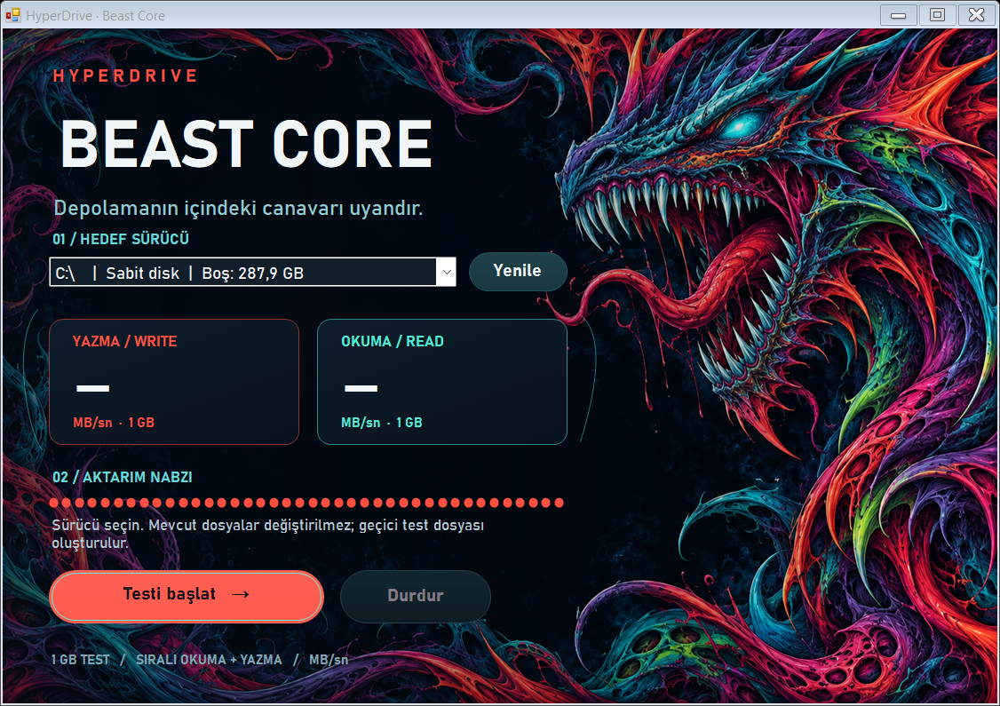

<p align="center"></p>
<p align="center"><a href="README.md">Türkçe</a> · <strong>English</strong></p>

# HyperDrive · Beast Core

HyperDrive is a **Windows storage benchmark** developed by Arda Çobanoğlu with help from Codex. It writes a 1 GiB temporary file to a selected internal or external drive, reads it back, and displays separate write/read speeds in **MB/s**.

The first published **v0.1.0 development build** uses an original AI-generated creature illustration inspired by CS2 Hyper Beast, coral red and turquoise accents, Bahnschrift typography, and fully rounded custom buttons.

## Download

Open [release v0.1.0](https://github.com/ardacob/hyperdrive-beast-core/releases/tag/v0.1.0), download and extract `HyperDrive-Windows-v0.1.0.zip`, then run `HyperDrive.exe`. Select a drive and click **Testi başlat** (Start test). The app interface is Turkish.

No installation is required. Windows with .NET Framework 4.x is needed. The executable is not Authenticode-signed.

## Features

- Internal and external drives that have a Windows drive letter.
- Fixed 1 GiB sequential write/read test; separate decimal MB/s results.
- Windows file-cache bypass and write-through access.
- Progress, cancellation, and temporary file cleanup.
- Writable test-directory selection on the selected drive, allowing a standard C: test without administrator rights.
- DPI support and custom hover/pressed/disabled rendering for rounded buttons.



This development preview checks drawing with completed progress; it is not a measured performance result.

## Build

```powershell
git clone https://github.com/ardacob/hyperdrive-beast-core.git
cd hyperdrive-beast-core
powershell -ExecutionPolicy Bypass -File .\scripts\build.ps1
```

Output: `dist/HyperDrive.exe`. The build uses the Windows .NET Framework C# compiler, with no additional NuGet packages. Artwork and the DPI manifest are embedded in the executable.

## Scope and privacy

At least 1 GiB + 64 MiB of free space is required. Existing files are not modified. Benchmarks are local; no files or results are uploaded. The uniquely named temporary file is deleted after completion or cancellation. Force-terminating the app may leave the file behind; failed cleanup displays its location.

The test measures sequential file throughput, not random I/O, IOPS, latency, SMART health, or genuine capacity. Hardware caches, background activity, USB interfaces, and temperature affect results. The UI labels “1 GB” and “1.024 MB” mean 1 GiB and 1,024 MiB of test data; speed uses decimal MB/s.

During development, a 1 GiB C: read/write test, file length, and cleanup were verified. Button corner backgrounds were checked in hover, pressed, and disabled states. This does not constitute testing every device or display scale.

## Repository

`windows/` contains C# source and the DPI manifest; `assets/` contains artwork; `scripts/` contains the build script; `docs/` contains the preview and troubleshooting.

[Changelog](CHANGELOG.md) · [Troubleshooting (Turkish)](docs/TROUBLESHOOTING.md) · [Releases](https://github.com/ardacob/hyperdrive-beast-core/releases)

The artwork is AI-generated rather than official game artwork. This independent application is not affiliated with Valve or Counter-Strike.
